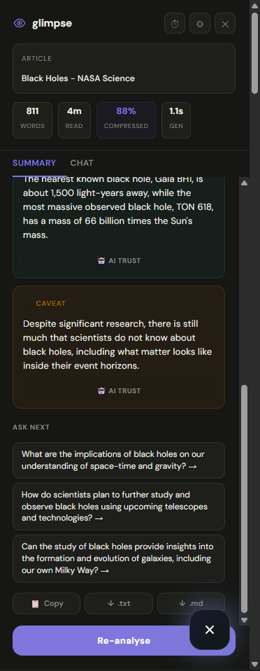
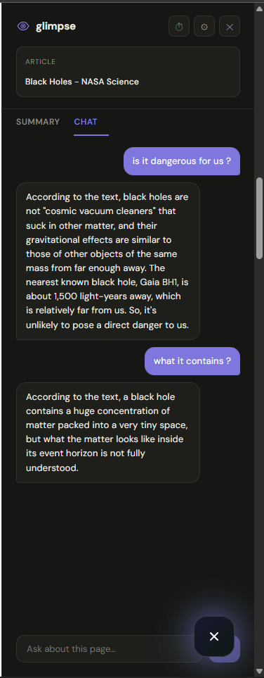
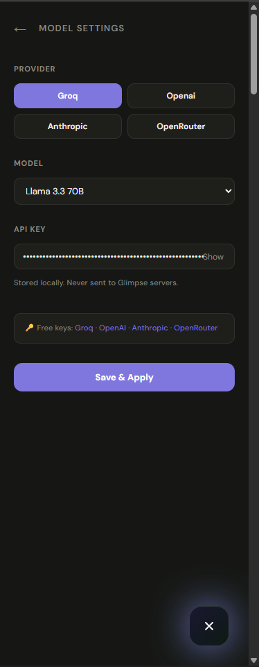
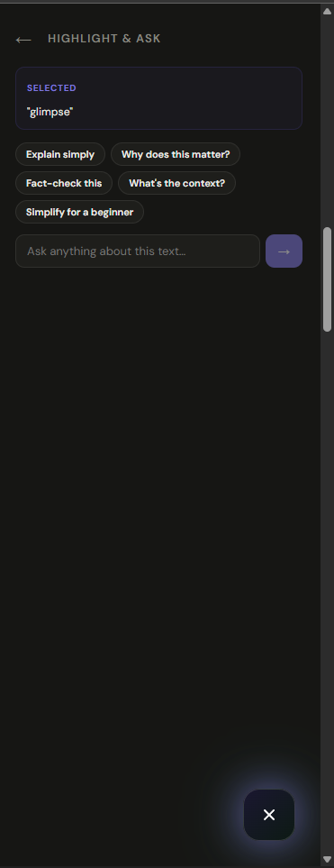
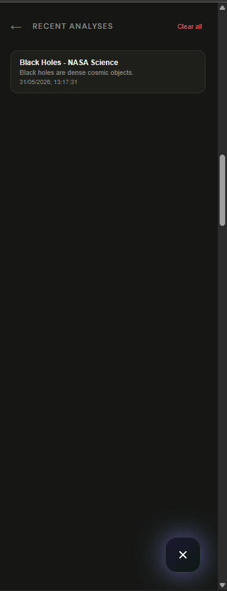
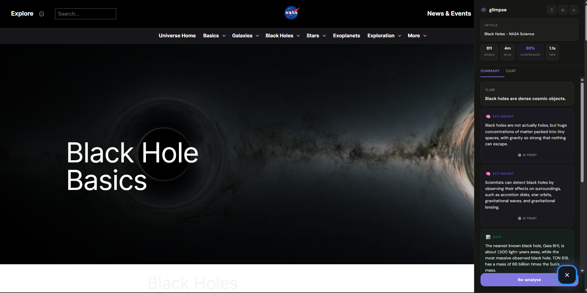

<div align="center">

<br/>

```
   ◉  G L I M P S E
```

### Your browser just got a brain.

Instant AI insights on any page — articles, Reddit threads, docs, products.<br/>
One hotkey. Zero subscriptions. Unlimited. Works with **Groq, OpenAI, Anthropic & OpenRouter.**

<br/>

[](https://groq.com)
[](https://openai.com)
[](https://anthropic.com)
[](https://openrouter.ai)
[](https://www.typescriptlang.org)
[](LICENSE)

<br/>

---

</div>

## What is Glimpse?

Glimpse is a Chrome extension that reads the page you're on and gives you an AI-powered **instant briefing** — without copy-pasting anything, switching tabs, or typing a prompt.

It slides in as a sidebar overlay on any page. Press **Alt+G**, get the insight, keep reading.

Bring your own API key from any provider. No backend. No subscriptions. No limits.

---

## Screenshots

**Sidebar on NASA's Black Holes page — summary generated in 1.1s**



<br/>

**Summary tab — TL;DR, key insights, data points, caveats, and smart follow-up suggestions**



<br/>

**Chat tab — ask anything, answers grounded strictly in the page**



<br/>

**Highlight & Ask — select any text on the page, instantly ask about it**



<br/>

**Recent Analyses — your reading history, locally stored**



<br/>

**Model Settings — switch provider and model on the fly**



---

## Features

**◉ Instant page briefing**  
Open the sidebar and Glimpse immediately generates a structured breakdown: TL;DR → Key Insights → Data points → Caveats. Not a vague summary — actual signal with numbers and names.

**◉ Chat with any page**  
Ask anything in the Chat tab. Glimpse answers using only the page content — it won't hallucinate. If something isn't covered, it says so.

**◉ Highlight & Ask**  
Select any text on the page. Glimpse pops up with one-click actions: *Explain simply*, *Why does this matter?*, *Fact-check this*, *What's the context?*, *Simplify for a beginner* — or type your own question.

**◉ Recent Analyses**  
Every page you've analysed is saved locally with a timestamp. Jump back to any previous summary without re-running.

**◉ Multi-provider support**  
Choose your AI provider and model from the settings panel:
- **Groq** — fastest inference, free tier, no monthly cap
- **OpenAI** — GPT-4o and friends
- **Anthropic** — Claude models
- **OpenRouter** — access any model through one key

**◉ Your key, your device**  
API keys are stored with `chrome.storage.local` — never sent to any server we control. The settings panel links directly to free keys for every provider.

**◉ Page stats**  
Word count, estimated read time, compression ratio, and generation time shown on every analysis.

---

## Install (dev build)

```bash
# 1. Clone
git clone https://github.com/MaximuxR93/GlimpseV1.git
cd GlimpseV1/pagepal-extension

# 2. Install deps
npm install

# 3. Build
npm run build
```

Load in Chrome:

1. Go to `chrome://extensions`
2. Enable **Developer mode** (top-right toggle)
3. Click **Load unpacked**
4. Select the `dist/` folder

The Glimpse eye icon appears in your toolbar and as a floating button on every page.

---

## Get an API key

| Provider | Free tier | Link |
|---|---|---|
| Groq | ✅ No monthly cap | [console.groq.com/keys](https://console.groq.com/keys) |
| OpenAI | Limited free credits | [platform.openai.com/api-keys](https://platform.openai.com/api-keys) |
| Anthropic | Limited free credits | [console.anthropic.com](https://console.anthropic.com) |
| OpenRouter | Free models available | [openrouter.ai/keys](https://openrouter.ai/keys) |

On first launch, Glimpse walks you through setup. Keys are stored locally — never shared.

---

## How it works

```
You open a page
      ↓
content.ts extracts page text
(semantic selectors → density scoring → Reddit special case → fallback)
      ↓
Alt+G opens the Glimpse sidebar
      ↓
AI call → structured analysis
  TL;DR · Key Insights · Data · Caveats · Follow-up suggestions
      ↓
Chat tab → full Q&A grounded in page content
Highlight & Ask → instant context on selected text
Recent Analyses → local history of every page you've glimpsed
```

All AI calls go **directly from your browser to your chosen provider** — no backend required.

---

## Stack

| Layer | Tech |
|---|---|
| Extension runtime | Chrome Manifest V3 |
| UI framework | React 18 + Vite |
| Language | TypeScript (strict) |
| Animations | Framer Motion |
| Shadow DOM isolation | react-shadow |
| AI providers | Groq · OpenAI · Anthropic · OpenRouter |
| Key storage | `chrome.storage.local` + `localStorage` fallback |

---

## Project structure

```
GlimpseV1/
├── pagepal-extension/
│   ├── src/
│   │   ├── components/
│   │   │   └── Sidebar.tsx       # Main UI — summary, chat, highlight, history, settings
│   │   ├── content/
│   │   │   └── index.tsx         # Content script — page extraction + sidebar mount
│   │   └── index.css
│   ├── public/
│   │   └── manifest.json
│   └── vite.config.ts
├── assets/                       # Screenshots for README
└── backend/                      # Optional FastAPI dev server (not required)
    └── main.py
```

---

## Keyboard shortcuts

| Shortcut | Action |
|---|---|
| `Alt + G` | Toggle Glimpse sidebar |
| `Enter` | Send chat message |
| `Shift + Enter` | New line in chat |

---

## Security

- API keys stored with `chrome.storage.local` — local to your browser only
- All AI calls go directly from browser → provider API
- No telemetry, no analytics, no backend receiving your data
- `.env` files are gitignored — never commit secrets
- Keys are auto-cleared if a 401 is returned

---

## Roadmap

- [ ] PDF support
- [ ] YouTube transcript extraction
- [ ] Export summary as Markdown
- [ ] Keyboard-navigable insights
- [ ] Firefox support (MV2 port)
- [ ] Pinned notes per page

Open an issue before starting anything major.

---

## License

MIT — do whatever you want with it.

---

<div align="center">

<br/>

Built with Groq inference and too much caffeine.

*If Glimpse saved you 10 minutes today, star the repo.*

⭐

<br/>

</div>
